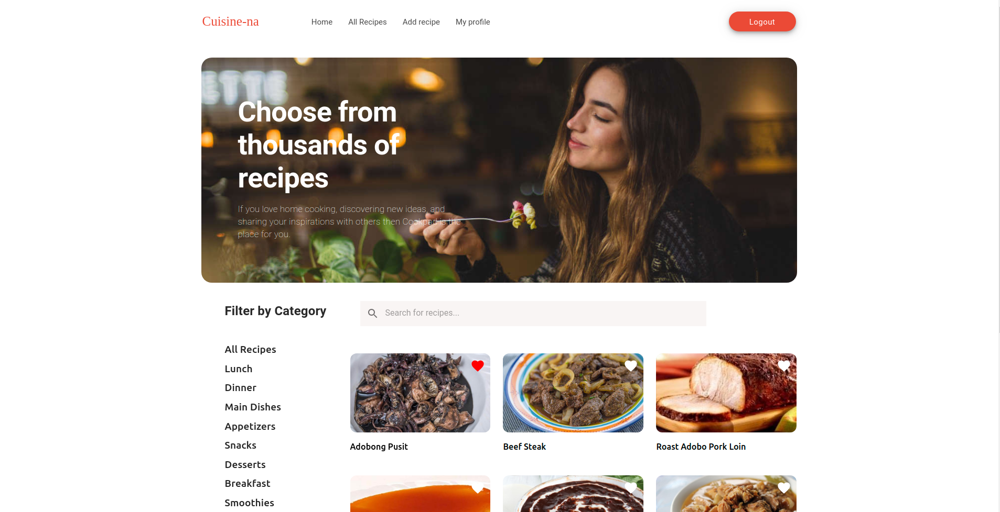

# Cuisine-na App

The proposed recipe app will help the users to prepare different delicious recipes in easy steps. It will provide lots of recipes with different tastes. The users can prepare the food they want by simply following the instructions provided by the app. It also has a feature of rating and review from the users of the app.



# Features of the App

  - Alots of recipe choices
  - Searching of recipes
  - Step by step instructions
  - Rating and review
  - Saving of favorite recipes
 
### Built with

* [Python](https://www.python.org/download/releases/3.0/)
* [React](https://reactjs.org/)
* [Material-UI](https://material-ui.com/)
* [Django](https://www.djangoproject.com)
* [Django REST Framework](https://www.django-rest-framework.org/)
* [SQLite 3](https://www.sqlite.org/index.html)

### Installation

1. Clone the repository
    ```bash
    $ git clone https://dev.izeni.net/boom-backend-19/recipe-app.git
    $ cd recipe-app/
    ```

2. Setup server

    Navigate to recipe-app/backend/
    ```bash
    $ cd backend/
    ```

    Create a virtual environment to install dependencies and activate it
    ```bash
    $ virtualenv env
    ```

    Install dependencies from the requirements file
    ```bash
    $ pip install -r requirements.txt
    ```

    Once pip has finished downloading the dependencies, setup the database
    ```bash
    $ python manage.py migrate
    ```

    Then run development server
    ```bash
    $ python manage.py runserver
    ```

3. Setup the app
    Navigate to recipe-app/frontend
    ```bash
    $ cd frontend/
    ```

    Install YARN packages and start app
    ```bash
    $ yarn install
    $ yarn start
    ```
    
## Tests
To run the tests for this app
    ```bash
    $ python manage.py test
    ```

    Then visit `http://localhost:3000/home` to view the app.
